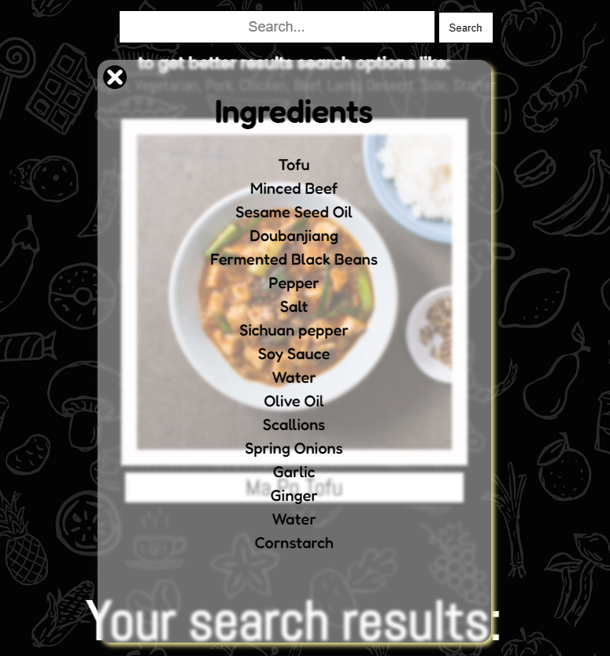

# TastyTips

Welcome to Tasty Tips! This web application provides a delightful culinary experience by offering a variety of easy and delicious recipes tailored for both kitchen pros and beginners. From simple weeknight meals to impressive dishes, Tasty Tips aims to make cooking enjoyable and accessible.

**Usage**
Upon entering the website, you will be greeted with a welcoming title, a logo, and a brief introduction to Tasty Tips.
Use the search bar to look for recipes based on your preferences. Enter keywords like "Vegan," "Dessert," or specific ingredients to get better results.
Click the "Search" button to initiate the search.
Explore the random recipe displayed on the page, including an image and the recipe's name.
Click on the random recipe image to view a modal with detailed ingredient information.

**Screenshots**

_caption: Title and logo of website with brief information_

_Caption: Explore a random recipe with an image and name._

_Caption: Search results displayed in a grid with recipe images and names._

_Caption: Modal displaying detailed ingredients of a recipe._

**Technical Details**

1. The application is built using HTML, CSS, and JavaScript.
2. It fetches recipe data from **TheMealDB API**.
3. Responsive design for usage on various devices.